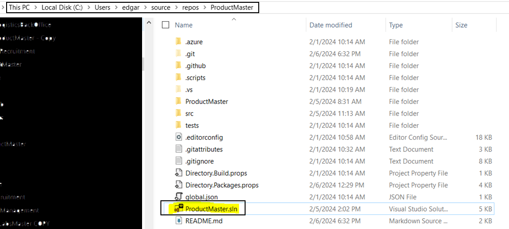

# ProductMaster Solution for Tekton Labs
## Download & Run
To run the web application:

```bash
Download or clone the repository: **ProductMaster,** unzip the file: **ProductMaster-master.zip** to
the folder you want.once unzipped. Proceed to select the ProductMaster.sln file to be opened with
Visual Studio 2022



Already in Visual Studio, select the project: Web as the main project


You can do this by selecting the project: **Web** and right clicking on it and on the pop-up menu
select the option **Set as startup project**

As a last step, make sure the execution is established in IIS Express (just for this test) and that the
 **web** project is established.


Don't forget to edit the files: **appsettings.json** located in the projects:

**Project Web**


**Project Test: Application.FunctionalTests**


 

 
Don't forget to edit the files: appsettings.json located in the projects:
Project Web
 
Project Test: Application.FunctionalTests
 

```

## Run Test

The solution contains unit, integration, and functional tests.

To run the tests:
```bash
dotnet test
```

## Technologies

The project contains the following technology:
```bash
•	ASP.NET Core 8
•	Entity Framework Core 8
•	MediatR
•	AutoMapper
•	FluentValidation
•	NUnit, FluentAssertions, Moq & Respawn
•	Fluent Assertions
•	Lazy Cache
•	RestSharp
•	Serilog
•	Moq
•	Nunit
•	Bogus
 ```
## Database
The project is configured for SQL server, once downloaded to your local PC, proceed to edit the file: appsettings.json located in the following projects:
```bash
•	src/Web
•	test/Application.FunctionalTests/
 ```
these are the changes:
```bash
  "ConnectionStrings": {
    "DefaultConnection": "Data Source=YourPC\\YourInstance;Initial Catalog=ProductMasterDb;User ID=YourUser;Password=YourPassword;MultipleActiveResultSets=True;Connect Timeout=100;Encrypt=False;"
  }
 ```
  
When you run the application the database will be automatically created, and be populated (if necessary) and the latest migrations will be applied.
Running database migrations is easy. Ensure you add the following flags to your command (values assume you are executing from repository root)
 ```
--project src/Infrastructure
--startup-project src/Web
--output-dir Data/Migrations
 ```
For example, to add a new migration from the root folder:
```bash
dotnet ef migrations add "SampleMigration" --project src\Infrastructure --startup-project src\Web --output-dir Data\Migrations
 ```
to run migrations: 
```bash
 dotnet ef database update -s  .\src\Web -v --context ProductMasterDbContext --project .\src\Infrastructure
 ```
## Help
edgarvalcarcel@hotmail.com
